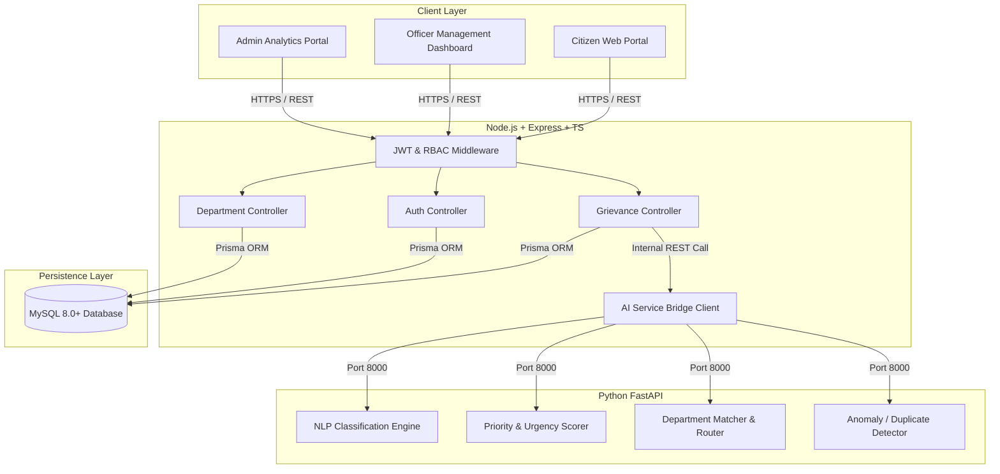

# PROJECT SETU - Architectural Design Document

## 1. System Overview

PROJECT SETU is designed as a modular, decoupled full-stack platform consisting of:
1. **Frontend Presentation Tier**: React 19 Single Page Application with Tailwind CSS and Vite.
2. **API & Business Logic Gateway**: Node.js / Express TypeScript service enforcing RBAC, business rules, and transaction boundaries.
3. **Relational Persistence Tier**: MySQL 8.0+ managed by Prisma ORM.
4. **AI Microservice Tier**: High-throughput Python FastAPI service running NLP grievance categorization, sentiment analysis, priority evaluation, and anomaly detection.

---

## 2. Component Topology & Network Flow

---

## 3. Communication Protocols

| Interface | Protocol | Serialization | Authentication |
| :--- | :--- | :--- | :--- |
| Client <-> Backend | HTTP/1.1 / HTTP/2 | JSON | JWT Bearer Token |
| Backend <-> MySQL | MySQL Native Protocol | Binary (Prisma Driver) | Database Credentials |
| Backend <-> AI Microservice | Internal HTTP/REST | JSON | Service API Key / Internal Network |

---

## 4. Security Architecture

1. **Defense-in-Depth**:
   - Helmet headers (XSS, CSP, frameguard).
   - Rate limiting on authentication and grievance submission endpoints.
   - Strict CORS configuration separating allowed frontend origins.
2. **Role-Based Access Control (RBAC)**:
   - Evaluated server-side via `roleGuard` middleware (`CITIZEN`, `OFFICER`, `SENIOR_OFFICER`, `ADMIN`).
   - Granular resource-level authorization (e.g., Citizens can only inspect their own grievances; Officers can only update complaints within their assigned department).
3. **Data Protection**:
   - Passwords hashed using `bcryptjs` with salt rounds >= 10.
   - Sensitive identification tokens (e.g., Aadhaar hashes) are non-reversible.
   - Comprehensive `AuditLog` capturing timestamp, actor ID, action, resource, and IP address.
