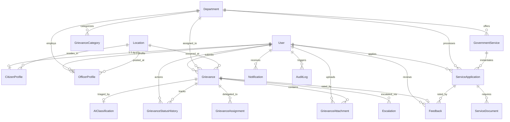

# PROJECT SETU - Relational Database Architecture Documentation

**Smart India Hackathon 2026**
- **Database Engine**: MySQL 8.0+ (InnoDB Engine)
- **ORM & Migrations**: Prisma ORM
- **Encoding**: `utf8mb4` | **Collation**: `utf8mb4_unicode_ci`

---

## 1. Entity Relationship (ER) Diagram

---

## 2. Core Relational Models

### 2.1 Identity & Access Management

#### `users`
| Column | Type | Nullable | Key / Default | Description |
| :--- | :--- | :--- | :--- | :--- |
| `id` | VARCHAR(191) | No | **PK** (UUID) | Unique system identifier |
| `email` | VARCHAR(191) | No | **UNIQUE** | User login email address |
| `phone` | VARCHAR(191) | Yes | **UNIQUE** | Mobile contact number |
| `passwordHash` | VARCHAR(191) | No | - | Bcrypt hashed password |
| `fullName` | VARCHAR(191) | No | - | Full legal name |
| `role` | ENUM | No | `'CITIZEN'` | `CITIZEN`, `OFFICER`, `SENIOR_OFFICER`, `ADMIN` |
| `isActive` | BOOLEAN | No | `true` | Account active state |
| `isEmailVerified`| BOOLEAN | No | `false` | Email confirmation state |
| `isPhoneVerified`| BOOLEAN | No | `false` | Mobile OTP confirmation state |
| `lastLoginAt` | DATETIME(3) | Yes | - | Timestamp of last session |
| `createdAt` | DATETIME(3) | No | `CURRENT_TIMESTAMP` | Record creation timestamp |
| `updatedAt` | DATETIME(3) | No | - | Auto-updated timestamp |

#### `citizen_profiles` (1-to-1 with `users`)
| Column | Type | Nullable | Key / Default | Description |
| :--- | :--- | :--- | :--- | :--- |
| `id` | VARCHAR(191) | No | **PK** (UUID) | Profile identifier |
| `userId` | VARCHAR(191) | No | **FK -> users(id)**, UNIQUE | Owner user account (Cascade delete) |
| `aadhaarHash` | VARCHAR(191) | Yes | **UNIQUE** | Salted cryptographic hash of Aadhaar number |
| `gender` | ENUM | Yes | - | `MALE`, `FEMALE`, `OTHER`, `PREFER_NOT_TO_SAY` |
| `dateOfBirth` | DATETIME(3) | Yes | - | Date of birth for age-restricted schemes |
| `addressLine1`| VARCHAR(191) | Yes | - | Residential street address |
| `addressLine2`| VARCHAR(191) | Yes | - | Apartment / Landmark |
| `pincode` | VARCHAR(191) | Yes | - | 6-digit postal code |
| `locationId` | VARCHAR(191) | Yes | **FK -> locations(id)** | Normalized geography link |
| `emergencyContact`| VARCHAR(191)| Yes | - | Alternate contact number |
| `occupation` | VARCHAR(191) | Yes | - | Citizen profession |

#### `officer_profiles` (1-to-1 with `users`)
| Column | Type | Nullable | Key / Default | Description |
| :--- | :--- | :--- | :--- | :--- |
| `id` | VARCHAR(191) | No | **PK** (UUID) | Officer profile identifier |
| `userId` | VARCHAR(191) | No | **FK -> users(id)**, UNIQUE | Owner user account (Cascade delete) |
| `departmentId`| VARCHAR(191) | No | **FK -> departments(id)** | Assigned government department |
| `badgeNumber` | VARCHAR(191) | Yes | **UNIQUE** | Official government employee ID |
| `designation` | VARCHAR(191) | No | - | E.g. "Assistant Engineer", "Inspector" |
| `jurisdictionWard`| VARCHAR(191)| Yes| - | Administrative ward / territory scope |
| `locationId` | VARCHAR(191) | Yes | **FK -> locations(id)** | Base station location |
| `isAvailable` | BOOLEAN | No | `true` | Availability for new grievance assignment |
| `activeGrievanceCount`| INT | No | `0` | Live active load counter |
| `resolvedGrievanceCount`| INT| No | `0` | Cumulative resolved counter |

---

### 2.2 Administrative Masters

#### `departments`
| Column | Type | Nullable | Key / Default | Description |
| :--- | :--- | :--- | :--- | :--- |
| `id` | VARCHAR(191) | No | **PK** (UUID) | Department identifier |
| `code` | VARCHAR(191) | No | **UNIQUE** | E.g. `WATER_SUPPLY`, `ELECTRICITY`, `ROADS_HIGHWAYS` |
| `name` | VARCHAR(191) | No | - | Official department name |
| `description` | TEXT | Yes | - | Administrative mandate & duties |
| `nodalOfficerName`| VARCHAR(191)| Yes | - | Lead contact officer |
| `nodalOfficerEmail`| VARCHAR(191)| Yes | - | Escalation email inbox |
| `defaultSlaHours`| INT | No | `48` | Standard resolution SLA deadline |
| `escalationSlaHours`| INT | No | `24` | Escalated critical SLA window |
| `isActive` | BOOLEAN | No | `true` | Operating status |

#### `locations`
| Column | Type | Nullable | Key / Default | Description |
| :--- | :--- | :--- | :--- | :--- |
| `id` | VARCHAR(191) | No | **PK** (UUID) | Location record identifier |
| `state` | VARCHAR(191) | No | - | State or Union Territory |
| `district` | VARCHAR(191) | No | - | Administrative District |
| `subDistrict` | VARCHAR(191) | Yes | - | Tehsil / Taluka / Sub-division |
| `blockOrWard` | VARCHAR(191) | Yes | - | Municipal Ward or Development Block |
| `locality` | VARCHAR(191) | Yes | - | Village, Sector, or Colony |
| `pincode` | VARCHAR(191) | No | - | 6-digit postal code |
| `latitude` | DOUBLE | Yes | - | Geo-coordinate latitude |
| `longitude` | DOUBLE | Yes | - | Geo-coordinate longitude |

#### `grievance_categories`
| Column | Type | Nullable | Key / Default | Description |
| :--- | :--- | :--- | :--- | :--- |
| `id` | VARCHAR(191) | No | **PK** (UUID) | Category identifier |
| `departmentId`| VARCHAR(191) | No | **FK -> departments(id)** | Parent department (Cascade delete) |
| `name` | VARCHAR(191) | No | - | Category label |
| `code` | VARCHAR(191) | Yes | - | Machine-readable taxonomy code |
| `defaultPriority`| ENUM | No | `'MEDIUM'` | Default baseline priority |
| `defaultSlaHours`| INT | No | `48` | Target resolution duration |

---

### 2.3 Grievance Management & AI Layer

#### `grievances`
| Column | Type | Nullable | Key / Default | Description |
| :--- | :--- | :--- | :--- | :--- |
| `id` | VARCHAR(191) | No | **PK** (UUID) | Grievance record identifier |
| `trackingNumber`| VARCHAR(191)| No | **UNIQUE** | Citizen tracking token (e.g. `SETU-2026-881902`) |
| `citizenId` | VARCHAR(191) | No | **FK -> users(id)** | Lodging citizen (Restrict delete) |
| `departmentId`| VARCHAR(191) | Yes | **FK -> departments(id)**| Triaged department |
| `categoryId` | VARCHAR(191) | Yes | **FK -> grievance_categories(id)** | Classified problem category |
| `locationId` | VARCHAR(191) | Yes | **FK -> locations(id)**| Incident geographic point |
| `title` | VARCHAR(191) | No | - | Complaint subject |
| `description` | TEXT | No | - | Full issue details |
| `addressText` | VARCHAR(191) | Yes | - | Physical location text description |
| `pincode` | VARCHAR(191) | Yes | - | Local area postal code |
| `status` | ENUM | No | `'SUBMITTED'` | `SUBMITTED`, `AI_TRIAGED`, `ASSIGNED`, `IN_PROGRESS`, `UNDER_INSPECTION`, `RESOLVED`, `REJECTED`, `ESCALATED`, `REOPENED` |
| `priority` | ENUM | No | `'MEDIUM'` | `LOW`, `MEDIUM`, `HIGH`, `CRITICAL` |
| `isUrgent` | BOOLEAN | No | `false` | Life safety / hazard indicator |
| `slaDeadline` | DATETIME(3) | Yes | - | Calculated resolution cutoff timestamp |
| `slaBreached` | BOOLEAN | No | `false` | Indicates deadline overrun |
| `isEscalated` | BOOLEAN | No | `false` | Active senior escalation flag |
| `resolutionSummary`| TEXT | Yes | - | Officer closing report |
| `resolvedAt` | DATETIME(3) | Yes | - | Timestamp when marked resolved |

#### `ai_classifications` (1-to-1 with `grievances`)
| Column | Type | Nullable | Key / Default | Description |
| :--- | :--- | :--- | :--- | :--- |
| `id` | VARCHAR(191) | No | **PK** (UUID) | AI inference record ID |
| `grievanceId` | VARCHAR(191) | No | **FK -> grievances(id)**, UNIQUE | Linked grievance (Cascade delete) |
| `predictedDepartmentId`| VARCHAR(191)| Yes | **FK -> departments(id)** | Model suggested department |
| `predictedCategoryId` | VARCHAR(191)| Yes | **FK -> grievance_categories(id)**| Model suggested category |
| `predictedDepartmentCode`| VARCHAR(191)| Yes | - | E.g. `WATER_SUPPLY` |
| `confidenceScore`| DOUBLE | No | - | Model prediction confidence (0.0 to 1.0) |
| `priorityScore` | ENUM | No | - | Predicted urgency level |
| `detectedSentiment`| VARCHAR(191)| No | - | Sentiment (e.g. `FRUSTRATED_CRITICAL`) |
| `extractedKeywords`| JSON | Yes | - | Array of key NLP tokens extracted |
| `suggestedSlaHours`| INT | No | - | AI recommended SLA window |
| `isSpamOrGibberish`| BOOLEAN | No | `false` | Anomaly / noise detector flag |
| `isDuplicate` | BOOLEAN | No | `false` | Semantic duplicate complaint match |
| `modelVersion` | VARCHAR(191) | No | `'1.0.0-sih'` | Version of model pipeline used |

#### `grievance_status_histories`
| Column | Type | Nullable | Key / Default | Description |
| :--- | :--- | :--- | :--- | :--- |
| `id` | VARCHAR(191) | No | **PK** (UUID) | Event identifier |
| `grievanceId` | VARCHAR(191) | No | **FK -> grievances(id)** | Target grievance (Cascade delete) |
| `actorId` | VARCHAR(191) | Yes | **FK -> users(id)** | Acting user or NULL if system cron |
| `previousStatus`| ENUM | Yes | - | Status prior to transition |
| `newStatus` | ENUM | No | - | New status entered |
| `actionTaken` | VARCHAR(191) | No | - | E.g. `GRIEVANCE_SUBMITTED`, `OFFICER_ASSIGNED` |
| `remarks` | TEXT | Yes | - | Officer comments / reasoning |

#### `grievance_assignments`
| Column | Type | Nullable | Key / Default | Description |
| :--- | :--- | :--- | :--- | :--- |
| `id` | VARCHAR(191) | No | **PK** (UUID) | Assignment token ID |
| `grievanceId` | VARCHAR(191) | No | **FK -> grievances(id)** | Target grievance |
| `officerProfileId`| VARCHAR(191)| No | **FK -> officer_profiles(id)** | Assigned field officer |
| `assignedById`| VARCHAR(191) | Yes | **FK -> users(id)** | Supervisor or Admin delegator |
| `assignmentNotes`| TEXT | Yes | - | Special directives |
| `isActive` | BOOLEAN | No | `true` | Active handling officer flag |

#### `escalations`
| Column | Type | Nullable | Key / Default | Description |
| :--- | :--- | :--- | :--- | :--- |
| `id` | VARCHAR(191) | No | **PK** (UUID) | Escalation event identifier |
| `grievanceId` | VARCHAR(191) | No | **FK -> grievances(id)** | Target grievance |
| `escalationLevel`| ENUM | No | `'LEVEL_1_SUPERVISOR'`| `LEVEL_1_SUPERVISOR`, `LEVEL_2_HOD`, `LEVEL_3_DISTRICT_MAGISTRATE` |
| `status` | ENUM | No | `'TRIGGERED'` | `TRIGGERED`, `ACKNOWLEDGED`, `INVESTIGATING`, `RESOLVED`, `OVERRIDDEN` |
| `reason` | TEXT | No | - | SLA breach trigger or manual justification |
| `triggeredById`| VARCHAR(191) | Yes | **FK -> users(id)** | NULL if automated SLA cron worker |
| `escalatedToUserId`| VARCHAR(191)| Yes | **FK -> users(id)** | Senior officer assigned to intervene |

---

### 2.4 Citizen Public Services

#### `government_services`
| Column | Type | Nullable | Key / Default | Description |
| :--- | :--- | :--- | :--- | :--- |
| `id` | VARCHAR(191) | No | **PK** (UUID) | Service identifier |
| `code` | VARCHAR(191) | No | **UNIQUE** | E.g. `NEW_WATER_CONNECTION`, `SMART_METER_INSTALLATION` |
| `name` | VARCHAR(191) | No | - | Display title |
| `departmentId`| VARCHAR(191) | No | **FK -> departments(id)** | Governing department |
| `feeAmount` | DECIMAL(10,2)| No | `0.00` | Application statutory fee |
| `estimatedProcessingDays`| INT | No | `7` | Service turnaround guideline |
| `requiredDocuments`| JSON | Yes | - | List of mandatory document types |

#### `service_applications`
| Column | Type | Nullable | Key / Default | Description |
| :--- | :--- | :--- | :--- | :--- |
| `id` | VARCHAR(191) | No | **PK** (UUID) | Application identifier |
| `applicationNumber`| VARCHAR(191)| No | **UNIQUE** | Citizen tracking token (e.g. `APP-2026-440192`) |
| `citizenId` | VARCHAR(191) | No | **FK -> users(id)** | Applying citizen |
| `serviceId` | VARCHAR(191) | No | **FK -> government_services(id)** | Service catalog item |
| `departmentId`| VARCHAR(191) | No | **FK -> departments(id)** | Processing department |
| `status` | ENUM | No | `'SUBMITTED'` | `DRAFT`, `SUBMITTED`, `UNDER_REVIEW`, `DOCUMENT_VERIFICATION`, `APPROVED`, `REJECTED`, `COMPLETED` |
| `formData` | JSON | No | - | Form schema input responses |
| `reviewingOfficerId`| VARCHAR(191)| Yes | **FK -> users(id)** | Assigned scrutiny officer |

---

### 2.5 Citizen Feedback, Notifications & Security Auditing

#### `feedbacks`
| Column | Type | Nullable | Key / Default | Description |
| :--- | :--- | :--- | :--- | :--- |
| `id` | VARCHAR(191) | No | **PK** (UUID) | Feedback identifier |
| `citizenId` | VARCHAR(191) | No | **FK -> users(id)** | Rating citizen |
| `grievanceId` | VARCHAR(191) | Yes | **FK -> grievances(id)**, UNIQUE | Resolved grievance evaluated |
| `serviceApplicationId`| VARCHAR(191)| Yes| **FK -> service_applications(id)**| Service application evaluated |
| `rating` | INT | No | - | Overall score (1 to 5) |
| `timelinessRating`| INT | Yes | - | Speed rating (1 to 5) |
| `officerBehaviorRating`| INT| Yes | - | Professionalism rating (1 to 5) |
| `isSatisfied` | BOOLEAN | No | `true` | Binary satisfaction indicator |

#### `audit_logs`
| Column | Type | Nullable | Key / Default | Description |
| :--- | :--- | :--- | :--- | :--- |
| `id` | VARCHAR(191) | No | **PK** (UUID) | Immutable audit record ID |
| `actorId` | VARCHAR(191) | Yes | **FK -> users(id)** | Initiating actor |
| `action` | VARCHAR(191) | No | - | E.g. `GRIEVANCE_STATUS_UPDATED`, `OFFICER_ASSIGNED` |
| `entityType` | VARCHAR(191) | No | - | E.g. `GRIEVANCE`, `USER`, `SERVICE_APPLICATION` |
| `entityId` | VARCHAR(191) | Yes | - | Target record UUID |
| `ipAddress` | VARCHAR(191) | Yes | - | Client IPv4 / IPv6 address |
| `userAgent` | VARCHAR(191) | Yes | - | Browser client string |
| `changes` | JSON | Yes | - | Delta diff (`old_value` vs `new_value`) |
| `createdAt` | DATETIME(3) | No | `CURRENT_TIMESTAMP` | Tamper-evident timestamp |

---

## 3. Query Optimization & Indexing Strategy

1. **High-Frequency Lookups**:
   - `grievances(trackingNumber)`: Unique B-Tree index for instant citizen search.
   - `service_applications(applicationNumber)`: Unique index.
   - `users(email)` & `users(phone)`: Unique indexes for sub-millisecond login authentication.
2. **Dashboard & Filtering Optimization**:
   - `grievances(status, priority, departmentId)`: Compound and single-column indexes for fast officer workbench queue loading.
   - `grievances(slaDeadline, isEscalated)`: Filter for cron-based SLA monitoring workers.
   - `locations(pincode, district)`: Rapid geospatial aggregation.
3. **Audit & Timeline Queries**:
   - `grievance_status_histories(grievanceId, createdAt)`: Ordered index for chronological audit timeline rendering.
   - `audit_logs(actorId, entityType, entityId)`: Security trace indexing.
