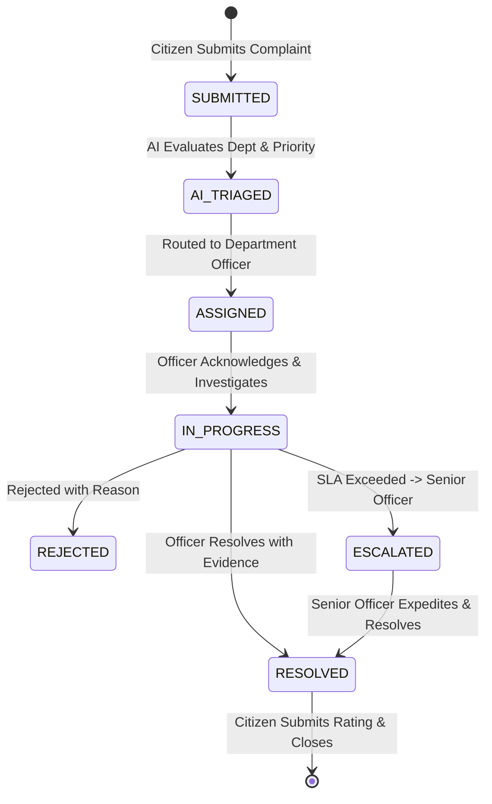

# PROJECT SETU - Operational Workflow & SLA Escalation Matrix

## 1. Grievance Lifecycle State Machine

---

## 2. Dynamic SLA & Escalation Hierarchy

| Priority Level | Default SLA Deadline | Escalation Trigger | Escalation Action |
| :--- | :--- | :--- | :--- |
| **`CRITICAL`** | **6 Hours** | > 4 Hours without assignment | Direct alert to Senior Officer / HOD |
| **`HIGH`** | **24 Hours** | > 18 Hours without progress | Automatic re-assignment & warning flag |
| **`MEDIUM`** | **48 Hours** | > 40 Hours without progress | Supervisor notification |
| **`LOW`** | **72 Hours** | > 60 Hours without progress | Department dashboard reminder |

---

## 3. AI Triage Pipeline

1. **Text Normalization**: Strips noise, extracts location hints and contact references.
2. **Category Classification**: Scans semantic keywords and vector embeddings to predict relevant municipal or state authority.
3. **Priority & Sentiment Scoring**: Evaluates safety keywords (e.g. "sparking", "flooding", "hazard", "hospital emergency") to assign dynamic priority.
4. **Department Routing**: Emits confidence score. If confidence is below threshold (< 0.70), routes to human triage queue.
